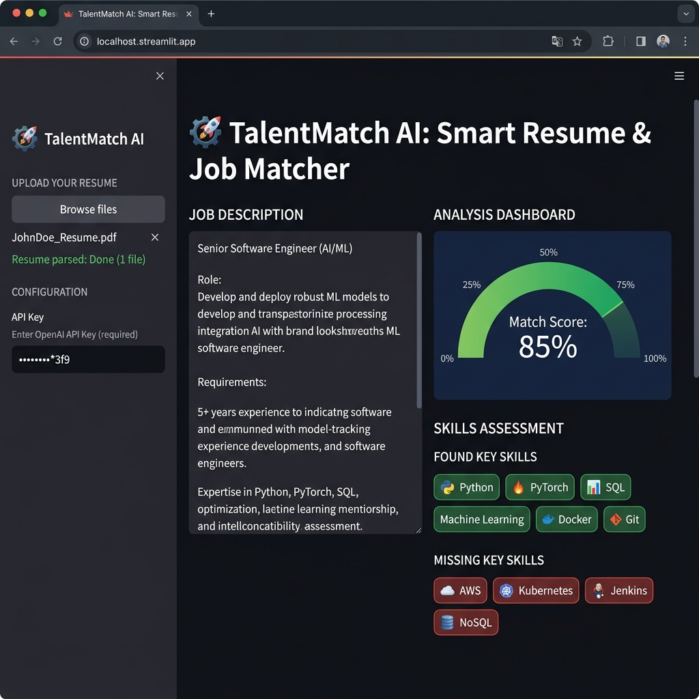
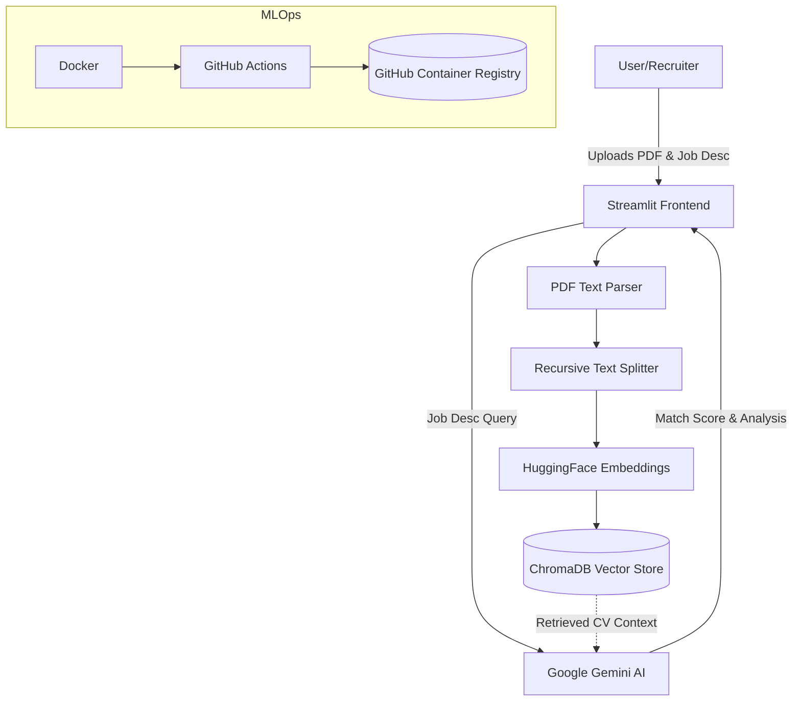

<div align="center">
  
  <h1>🎯 TalentMatch AI</h1>
  <p><strong>A Next-Generation Resume & Job Matching AI powered by RAG and LLMs.</strong></p>
</div>

---

## 🚀 Overview

**TalentMatch AI** is a state-of-the-art AI application designed to evaluate a candidate's resume against a specific job description. By utilizing **Retrieval-Augmented Generation (RAG)** and **Google's Gemini API**, the system extracts key information from PDFs, performs semantic similarity search using **ChromaDB**, and provides an intelligent evaluation report including a Match Score, Matched Skills, and Missing Skills.

This project demonstrates advanced capabilities in Generative AI, Natural Language Processing, and intelligent application architecture.

<div align="center">
  
</div>

## 🌟 Key Features

- **📄 Intelligent Document Parsing:** Automatically reads and chunks PDF resumes using `pypdf`.
- **🧠 Advanced Vector Search (RAG):** Uses HuggingFace embeddings (`all-MiniLM-L6-v2`) and `ChromaDB` for highly accurate semantic search.
- **🤖 LLM Integration:** Powered by the official Google Generative AI SDK mapping directly to flash models for expert-level HR evaluation.
- **📊 Dynamic Visualizations:** Beautiful interactive match score gauge generated with `Plotly`.
- **🖥️ Clean UI:** Built entirely on `Streamlit` for a seamless user experience.
- **🐳 MLOps Ready:** Fully containerized with **Docker** and automated via **GitHub Actions CI/CD pipeline** for testing and image deployment.

---

## 🏗️ System Architecture



---

## 🛠️ Technology Stack

<p align="center">
  <a href="https://skillicons.dev">
    
  </a>
</p>

- **Framework:** Streamlit
- **AI/LLM Engine:** Google Gemini SDK, LangChain
- **Embeddings:** HuggingFace Sentence Transformers
- **Vector Database:** ChromaDB
- **MLOps:** Docker, GitHub Actions (CI/CD)

---

## 💻 Getting Started

### Prerequisites
- Python 3.11+ or Docker Desktop
- A Free [Google Gemini API Key](https://aistudio.google.com/app/apikey)

### Option 1: Running with Docker (Recommended)
Since this project is fully containerized, you don't need to install any python packages manually.
```bash
docker pull ghcr.io/dtscntst1/talentmatch-ai:latest
docker run -p 8501:8501 ghcr.io/dtscntst1/talentmatch-ai:latest
```

### Option 2: Installation Locally

1. **Clone the repository:**
   ```bash
   git clone https://github.com/DtScntst1/TalentMatch-AI.git
   cd TalentMatch-AI
   ```

2. **Create a virtual environment:**
   ```bash
   python -m venv venv
   source venv/bin/activate  # On Windows use `venv\Scripts\activate`
   ```

3. **Install the dependencies:**
   ```bash
   pip install -r requirements.txt
   ```

4. **Run the Streamlit app:**
   ```bash
   streamlit run app.py
   ```

## 📈 Future Enhancements
- Integration with LinkedIn profile links instead of PDF uploads.
- Cover Letter Generation based on the missing skills.
- Multi-resume batch processing for real HR recruiters.

---
*Built with ❤️ for the Data Science Community.*
